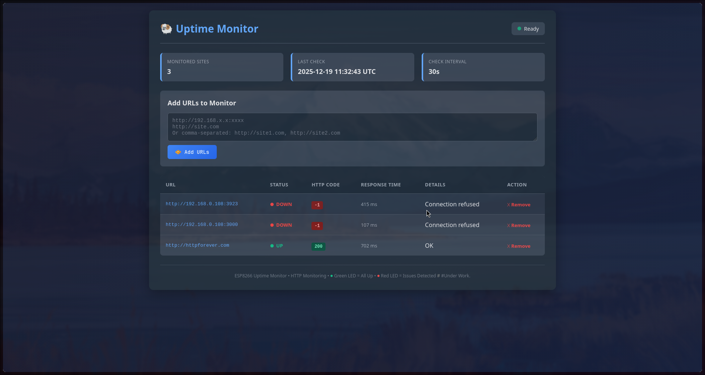
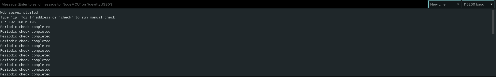

# ESP8266 Uptime Monitor

A self-hosted uptime and availability monitoring tool that runs entirely on an ESP8266.  
The device periodically checks a list of HTTP endpoints, records their status and response time, and presents the results through a built-in web dashboard.

This project is intended for local networks, homelabs, and self-hosted services.

---
## Overview

The ESP8266 connects to a Wi-Fi network, loads a list of URLs from flash storage, and checks each endpoint at a specific interval. The results are displayed through a web interface hosted on the device. Configuration persists across reboots using LittleFS.

---
## Features
- Periodic uptime checks with configurable interval
- HTTP response code reporting
- Response time measurement in milliseconds
- Persistent configuration storage using LittleFS
- Add and remove monitored URLs via the web interface
- Duplicate URL detection
- NTP time synchronization with UTC timestamps
- Serial command interface for basic control and debugging
- LED status indicator logic (see notes below)

---
## Intended Use
This project is designed for monitoring:
- Local network services
- Self-hosted applications

It is not intended for public internet exposure.

---
## Limitations
- HTTPS is not supported. Only HTTP endpoints are accepted.
- Not suitable for monitoring external public services.
- LED status indicators are not hardware-tested yet.

---
## Hardware Requirements
- ESP8266 development board (NodeMCU, Wemos D1 Mini, etc.)
- Optional LEDs and resistors (see LED status section)

---
## LED Status Indicators (Under Development)
The LED status indicator feature is currently under development and has not been physically tested.

Due to the lack of available hardware at the time of development, the LED logic is implemented in software but may require adjustments once tested on real hardware.

### Intended Behavior

- Green LED: all monitored sites are reachable
- Red LED: one or more monitored sites are unreachable

### Current Status
- LED logic is implemented in the firmware
- No physical validation has been performed
- GPIO pins and logic levels may need adjustment depending on board

---
## Software Requirements
- Arduino IDE
- ESP8266 board support installed

### Required Libraries
Install the following via the Arduino Library Manager:

- ESPAsyncWebServer
- ESPAsyncTCP

---
## Configuration

Edit the following values in the source code before uploading:

```cpp
const char* ssid     = "PUT_YOUR_SSID_HERE";
const char* password = "PUT_YOUR_PASSWORD_HERE";

const unsigned long CHECK_INTERVAL = 30000;
```

The check interval is specified in milliseconds.

---
## Installation
1. Open the sketch in Arduino IDE
2. Select the correct ESP8266 board and serial port
3. Upload the firmware
4. Open the Serial Monitor at 115200 baud
5. Note the assigned IP address
6. Open a browser and navigate to:

```
http://<ESP_IP_ADDRESS>/
```

---
## Web Interface
The web interface allows you to:

- Add new URLs for monitoring    
- Remove existing URLs
- View current status, HTTP response codes, and response times
- See the time of the last check



### URL Format
Only HTTP URLs are accepted.

Examples:

```
http://192.168.1.10:8080
http://myservice.local
```

---
## Serial Commands
The firmware supports simple serial commands for debugging and control.

| Command | Description                        |
| ------- | ---------------------------------- |
| ip      | Prints the current IP address      |
| check   | Triggers an immediate uptime check |



---
## Persistent Storage

- Monitored URLs are stored in flash memory using LittleFS    
- Configuration survives reboots and power cycles

---
## Time Synchronization
- Uses NTP servers for time synchronization
- Timestamps are displayed in UTC
- Requires internet access for initial time sync

---
## Error Handling
HTTP and connection errors are translated into human-readable messages.

Examples include:
- Connection failed
- Timeout
- Not found
- Server error
- Service unavailable

---
## Best Practices
- Avoid redirects
- Use reasonable check intervals to avoid network congestion

---
## Notes

This project was developed without physical LED hardware for validation.  
If you test or improve the LED functionality contributions are welcome.

---

btw i don't have commits because i have md other public repo but i had acidentally pushed my private info in it so i had to take it down.